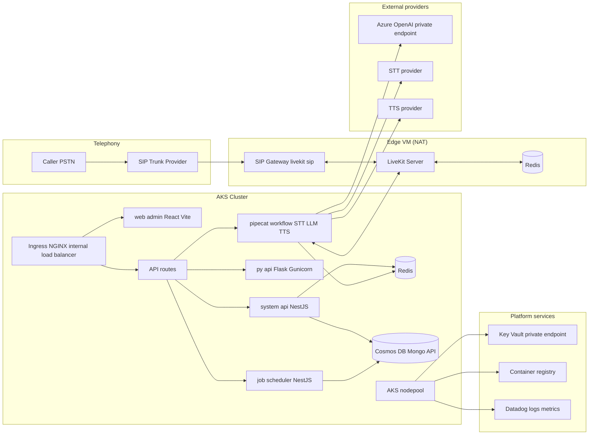
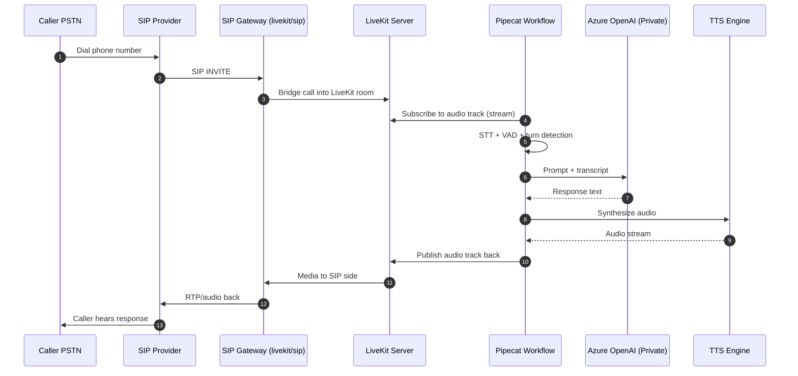
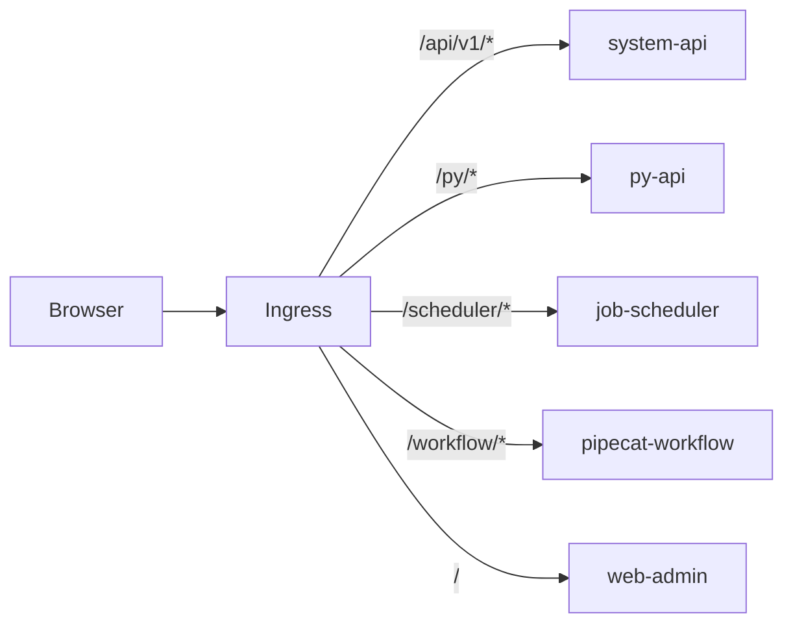
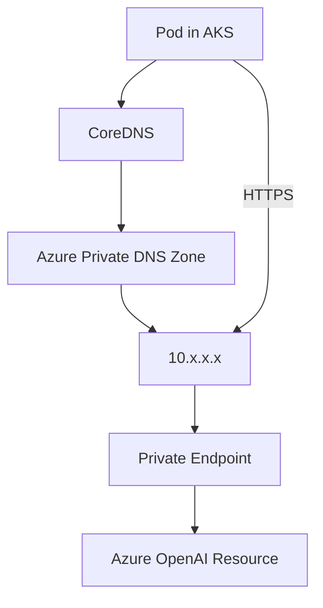

> **Audience:** engineers building and operating real‑time systems on Kubernetes/Azure.  
> **Privacy note:** all identifiers (IPs, hostnames, registry names, cluster names, secrets) are **placeholders**.

## TL;DR

We shipped a production voice AI system that answers live phone calls end‑to‑end:

- **PSTN/SIP → LiveKit → Pipecat workflow → Azure OpenAI → audio back to caller**
- **Public access disabled** for Azure OpenAI + Key Vault (**private endpoints only**)
- **Secrets never in git**: Key Vault is the source of truth, injected into K8s at deploy time
- Biggest production failures were not “LLM problems” — they were:
  - **private endpoint DNS resolving to public IPs** (403/PermissionDenied)
  - **image tag drift** (`:latest`) causing non‑prod to run prod UI
  - **hostPort rollouts** stuck Pending
  - **native module crashes** (bcrypt) + unstable Python base images
  - **internal ingress** blocked by **subnet exhaustion**

If you’re building “real‑time AI on Kubernetes,” the hard part is the **plumbing**: DNS, NAT, ports, deterministic deploys, and debuggability.

---

## What We Built

A real‑time voice agent that:

- accepts inbound phone calls (SIP / PSTN)
- streams audio with low latency
- runs the agent loop (STT → LLM → TTS)
- responds back to the caller (with reasonable turn‑taking)
- keeps data private (no public OpenAI/Key Vault access)
- deploys reliably across **non‑prod** and **prod**

---

## System Architecture

We ended up with an architecture that separates the **real‑time edge** from the **Kubernetes app platform**.

- **Edge VM (stable NAT/ports):**
  - `livekit/sip` (SIP gateway)
  - `livekit-server`
  - Redis (for LiveKit signaling/session needs in that segment)

- **AKS cluster (services + workflows):**
  - `web-admin` (React + Vite)
  - `system-api` (NestJS)
  - `py-api` (Flask + Gunicorn)
  - `job-scheduler` (NestJS)
  - `pipecat-workflow` (Python, orchestrates STT/LLM/TTS)
  - Redis + Mongo/Cosmos (platform state)

- **Azure services:**
  - Azure OpenAI (**private endpoint**)
  - Key Vault (**private endpoint**)
  - ACR for images
  - Datadog for logs/metrics (especially when prod kubectl access is limited)



---

## Call Flow (SIP → WebRTC → Agent Loop → Audio Back)

This is the actual “hot path.” Any failure here is user‑visible in seconds.



---

## Performance: VAD, Turn‑Taking, and Why WAV Tests Lied

The single most sensitive tuning parameter was **VAD** (voice activity detection):

- Too strict → no transcripts → “silent” AI
- Too loose → false triggers → noisy replies / interruptions

Two rules that mattered:

1. **Tune on real phone audio**, not clean WAVs.
2. Prefer **shorter stop timeouts** (reduce awkward silence) but cap it with:
   - a minimum utterance duration
   - noise filtering

I’m intentionally not claiming universal best settings — the right values depend on phone codecs, ambient noise, and your STT provider — but the shape of the problem is consistent.

---

## Edge Networking: NAT + Ports + Reality

Real‑time voice is extremely sensitive to NAT and firewall configuration.

### Ports we had to make deterministic

- SIP signaling: **TCP/UDP 5060**
- LiveKit:
  - HTTP API (custom): **1124/tcp**
  - ICE/TCP: **7881/tcp**
  - RTP/UDP range: we constrained to **50000–50100/udp** for testability

### Why we disabled “automatic external IP discovery”

When SIP config used `use_external_ip: true`, the container attempted external discovery (STUN-like behavior). In locked‑down networks, that can hang or fail, and your “SIP stack” becomes flaky for non-obvious reasons.

Stable approach:

- `use_external_ip: false`
- `nat_1_to_1_ip: <PUBLIC_IP>`

### LiveKit config example (`livekit.yaml`)

```yaml
port: 1124
bind_addresses:
  - "0.0.0.0"

rtc:
  tcp_port: 7881
  port_range_start: 50000
  port_range_end: 50100
  use_external_ip: false
  enable_loopback_candidate: false

webhook:
  api_key: "<LIVEKIT_API_KEY>"
  urls:
    - "http://<INTERNAL_INGRESS_OR_LB>/pipecat/livekit/webhook"

redis:
  address: "redis:6379"
  username: ""
  password: ""
  db: 0

keys:
  "<LIVEKIT_API_KEY>": "<LIVEKIT_API_SECRET>"
```

### Docker Compose example (SIP + LiveKit + Redis)

```yaml
version: "3.3"
services:
  redis:
    image: redis:latest
    ports:
      - "6379:6379"

  sip:
    image: livekit/sip:latest
    depends_on: [redis]
    environment:
      SIP_CONFIG_BODY: |
        api_key: <SIP_API_KEY>
        api_secret: <SIP_API_SECRET>
        log_level: debug
        redis:
          address: redis:6379
        ports:
          udp: 5060
          tcp: 5060
        use_external_ip: false
        nat_1_to_1_ip: <PUBLIC_IP>
    ports:
      - "5060:5060/tcp"
      - "5060:5060/udp"

  livekit:
    image: livekit/livekit-server:latest
    depends_on: [redis]
    command: ["--config", "/livekit.yaml"]
    volumes:
      - ./livekit.yaml:/livekit.yaml
    ports:
      - "1124:1124/tcp"
      - "7881:7881/tcp"
      - "50000-50100:50000-50100/udp"
```

### The most embarrassing blocker: “config file is a directory”

LiveKit crashed with:

- `read /livekit.yaml: is a directory`

Cause: a directory named `livekit.yaml` existed instead of a file.

Fix: delete the directory, create the actual file. This looked like a runtime failure, but it was a filesystem footgun.

### Port verification commands we used constantly

```bash
# On the edge VM
docker ps
docker logs --tail 80 <sip-container>
docker logs --tail 80 <livekit-container>

# Quick reachability checks
nc -vz <PRIVATE_IP> 1124
nc -vz <PRIVATE_IP> 5060
nc -u -vz <PRIVATE_IP> 5060
nc -u -vz <PRIVATE_IP> 50000
```

---

## AKS Platform Layer: Multi‑Service Reality (and the Bugs You Only See in Prod)

The AKS side was a “normal” multi-service platform… which means the failures were mostly “normal” too.

### Service layout

- `web-admin` (React + Vite)
- `system-api` (NestJS)
- `py-api` (Flask + Gunicorn)
- `job-scheduler` (NestJS)
- `pipecat-workflow` (Python)
- Redis + Mongo/Cosmos

### Versioned APIs + ingress mapping

We use versioned endpoints (e.g. `/api/v1/...`). Early on, we had ingress exposing only `/api/v2`, which caused 404/405 from the UI.

Fix: route `/api/v1` to the correct service.



### Redis “ENOTFOUND” is usually not Redis — it’s DNS or missing service

We saw errors like:

- `Redis getaddrinfo ENOTFOUND redis-db.default.svc.cluster.local`

In our case, it wasn’t a transient DNS issue. We simply **didn’t have Redis deployed** where the app expected it.

Fix: add Redis deployment + service in AKS (or update config to match reality).

---

## Security First: Key Vault + Private Endpoints (and Why DNS Becomes a Runtime Dependency)

We enforced:

- Secrets do not live in the repo
- Secrets do not move between environments manually
- Prod uses private network paths

### The rule: “Key Vault is the source of truth”

- Separate Key Vault per environment
- CI/CD pulls secrets and injects them at deploy time
- Kubernetes receives secrets as generated `Secret` manifests or env injection

---

## The Biggest Incident: Azure OpenAI Private Endpoint Looked Fine… Until It Didn’t

### Symptom

Production calls failed with:

- `openai.PermissionDeniedError: Public access is disabled. Please configure private endpoint.`
- HTTP 403 on requests that worked in non‑prod

### Root cause

Azure OpenAI public access was disabled ✅  
…but **DNS inside AKS resolved the OpenAI hostname to a public IP** (20.x.x.x) ❌

So pods tried to hit the public endpoint, which Azure blocked.

### The fix (Azure side)

We ensured:

- Private DNS zone exists: `privatelink.openai.azure.com`
- Correct A record exists:
  - `<openai-resource-name> → 10.x.x.x`
- Private DNS zone is linked to the AKS VNet
- CoreDNS updated/restarted (and we validated resolution **from inside** the cluster)

### What “good” looks like



### The permanent guardrail: DNS gate in CI/CD

We fail the deployment if the OpenAI hostname resolves to a public IP from the cluster network context.

Conceptually:

```bash
#!/usr/bin/env bash
set -euo pipefail

HOSTNAME="<your-azure-openai-endpoint-hostname>"
MAX_RETRIES=12
SLEEP_SECONDS=10

echo "Checking DNS resolution for ${HOSTNAME} inside cluster context..."

for i in $(seq 1 "$MAX_RETRIES"); do
  IP=$(nslookup "${HOSTNAME}" 2>/dev/null | awk '/Address: /{print $2}' | tail -n 1 || true)

  if [[ -z "${IP}" ]]; then
    echo "Attempt ${i}/${MAX_RETRIES}: DNS empty. Retrying..."
    sleep "${SLEEP_SECONDS}"
    continue
  fi

  if [[ "${IP}" =~ ^10\.|^172\.1[6-9]\.|^172\.2[0-9]\.|^172\.3[0-1]\.|^192\.168\. ]]; then
    echo "OK: ${HOSTNAME} resolved to private IP ${IP}"
    exit 0
  fi

  echo "Attempt ${i}/${MAX_RETRIES}: BAD: ${HOSTNAME} resolved to public IP ${IP}. Retrying..."
  sleep "${SLEEP_SECONDS}"
done

echo "FAIL: ${HOSTNAME} never resolved to a private IP. Aborting deployment."
exit 1
```

**Takeaway:** Private endpoints don’t “just work” — **DNS correctness is a production dependency**.

---

## CI/CD: What We Changed to Make Deployments Boring

We deploy from a monorepo using Azure DevOps pipelines.

### Pipeline design goals

- build only what changed (fast feedback)
- deterministic deploys (immutable tags)
- environment isolation (prod vs non‑prod)
- fail fast (stage gating + validation)
- debugging without “SSH into prod”

### The pipeline flow (high level)

```mermaid
flowchart LR
  Git[Git push] --> CI[CI build and test]
  CI --> Build[Build images]
  Build --> Tag[Tag images]
  Tag --> Push[Push to ACR]
  Push --> Secrets[CD pull env file]
  Secrets --> DNSGate[Gate OpenAI DNS private IP]
  DNSGate --> Stamp[Stamp manifests]
  Stamp --> TargetCheck[Gate verify cluster]
  TargetCheck --> Apply[Apply manifests]
  Apply --> Rollout[Check rollout status]
  Rollout --> Logs[Diagnostics logs]
  Logs --> Done[Deploy complete]
```




---

## The “Non‑Prod UI Called Prod” Incident: Vite + `:latest` + Cached Images

### Symptom

Non‑prod UI started calling prod endpoints.

### Root causes

1) **Frontend env is compile-time with Vite**  
Values like `VITE_SYSTEM_API_BASE_URL` are baked into the JS bundle at build time.

2) **Both environments pulled `web-admin:latest`**  
If prod pipeline ran last, non‑prod could pull the prod build.

### Fix

- Build environment-specific frontend images
- Tag by environment and also by build ID:
  - `web-admin:nonprod`
  - `web-admin:prod`
  - `web-admin:<BuildId>` (immutable)

**Takeaway:** For frontend builds, “runtime env injection” is often a myth. Build the right artifact.

---

## Kubernetes Rollout Pitfall: `hostPort` is a Rolling Update Footgun

We had deployments pinning `hostPort` values (e.g., 8080, 8084, 4050). During rollouts:

- old pod still binds the port on the node
- new pod can’t schedule
- rollout stalls with Pending pods

Fix:

- remove `hostPort`
- use Services + Ingress
- let the scheduler do its job

---

## Runtime Stability Incidents (and the Fixes)

### 1) CrashLoopBackOff: native Node bindings (bcrypt)

Error pattern:

- `Error: Cannot find module ... bcrypt_lib.node`

Root cause: missing build dependencies / rebuild steps for native modules.

Fix (conceptual Dockerfile steps):

```dockerfile
RUN apt-get update && apt-get install -y \
  python3 make g++ \
  && rm -rf /var/lib/apt/lists/*

RUN pnpm install --frozen-lockfile
RUN pnpm rebuild bcrypt
```

### 2) Python worker crashes: alpha Alpine image → segfaults (exit code 139)

We saw:

- `Worker (pid:###) was sent code 139`
- evictions due to massive ephemeral storage from crash loops

Root cause: alpha Python + Alpine instability (`python:3.14.0a4-alpine` class of problems).

Fix: use stable Debian-based images (e.g., `python:3.11-slim`) and rebuild dependencies cleanly.

### 3) ImagePullBackOff after infra changes

After subnet/identity changes, pods failed pulling from ACR.

Fix: verify ACR attachment / permissions for the AKS identity (or configure imagePullSecrets).

---

## Private Ingress: “Pending” Can Be a Subnet Capacity Problem

We moved ingress behind an internal load balancer:

```yaml
metadata:
  annotations:
    service.beta.kubernetes.io/azure-load-balancer-internal: "true"
```

Then Azure refused to allocate an IP:

- `SubnetIsFull (10.x.x.x/26)`

Lesson:

> Even “just Kubernetes YAML” depends on real subnet capacity planning.

---

## Debug Playbook (What Actually Saved Us)

When the system breaks, we debug in a strict order to avoid thrash:

1. **DNS resolution inside cluster** (private endpoints)
   - `nslookup <openai-hostname>` from a pod / `az aks command invoke`
2. **Environment variables inside running pods**
3. **Live logs across services** (15‑minute tail during rollout)
   - `kubectl logs -l 'app in (pipecat-workflow,system-api)' -f --tail=200`
4. **Key Vault secret presence + sanity checks** (exists, correct length)
5. **Edge port reachability** (SIP/LiveKit)
6. **Datadog** (when prod kubectl access is restricted)

This let us isolate whether a failure was:

- telephony ingress
- media routing
- workflow logic
- OpenAI connectivity
- secrets/config
- deployment artifact drift

---

## Outcomes

After implementing the guardrails and fixes:

- stable end-to-end call flow (no more “random” OpenAI 403s)
- hard separation between prod and non‑prod artifacts
- predictable rollouts (build ID stamping)
- fewer stuck deployments (hostPort removed)
- improved MTTR with repeatable checks + centralized logs


---

## Lessons Learned

- **DNS + private endpoints are runtime dependencies**, not “infra background noise.”
- **Never share `:latest` across environments.** It’s a trap.
- **Frontend env vars are often compile‑time**, not runtime.
- **hostPort breaks rolling updates** unless you tightly control scheduling.
- **Native modules in containers require explicit build steps** (and stable base images).
- **Observability must work without kubectl** (private clusters + RBAC are normal in prod).
- “Correctness” includes **subnets, NSGs, private DNS links, and RBAC**, not just YAML.

---

## What I’d Improve Next

- distributed tracing across SIP → LiveKit → workflow → LLM → TTS
- canary releases for high-risk services
- config validation for LiveKit/SIP (schema + CI checks)
- GitOps (Argo/Flux) to reduce pipeline drift
- SLOs for call setup and response latency
- multi-region edge strategy for SIP + LiveKit

---

## Appendix: HN Submission Snippet

**Title:** From PSTN to Private Azure OpenAI: shipping a real‑time voice AI stack on AKS (war story)

**Text:**
I built and operated a real‑time voice AI stack on Azure: SIP → LiveKit → Pipecat → Azure OpenAI, with OpenAI/Key Vault behind private endpoints. The hardest issues weren’t “LLM problems” — they were DNS resolving private endpoints to public IPs (403s), `:latest` tag drift causing non‑prod to run prod UI, and rollout failures from `hostPort`. This post is a deep technical write‑up of what broke and the guardrails that made deployments boring.
