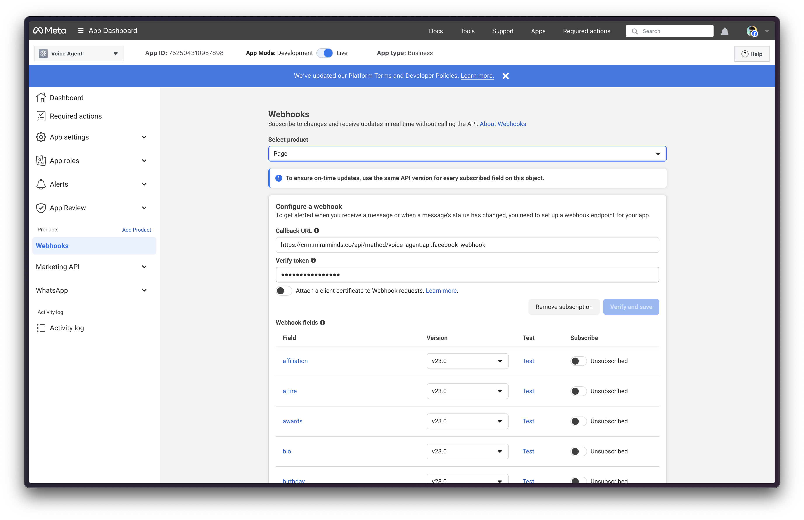
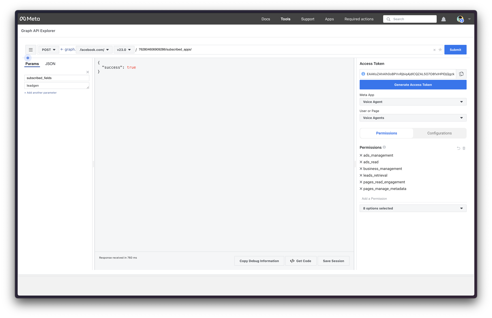
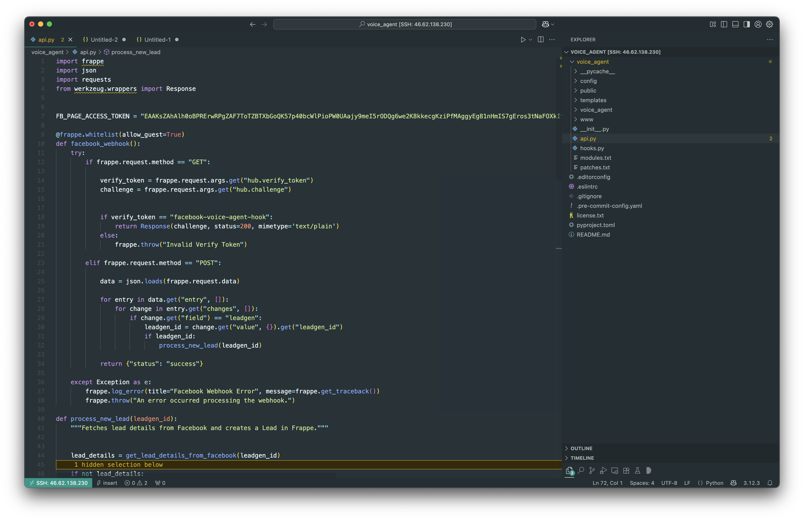
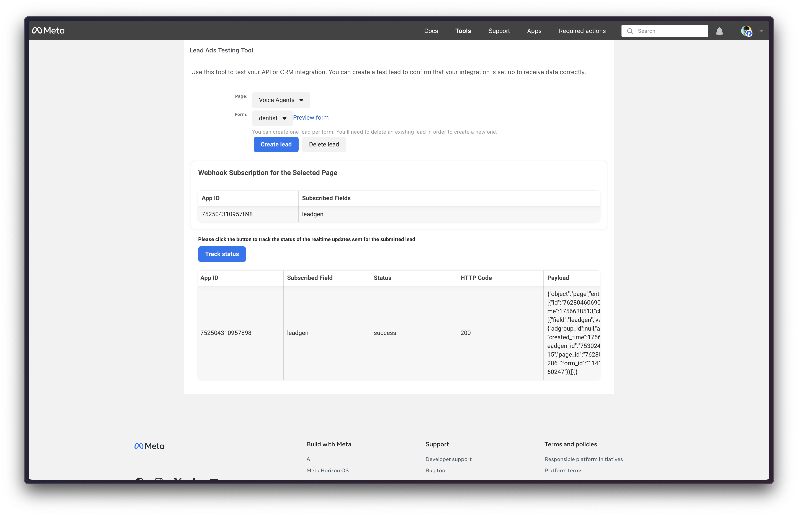

# From Facebook Click to AI Call in 5 Seconds: A Automation tales

*The real, unabridged chronicle of building our own real-time lead pipeline—a journey through failed attempts, architectural planning, obscure permission errors, and the final satisfaction of creating a system that puts Zapier to shame.*

My name is Sneh Mehta, and my reality as the founder of Mirai Minds is a constant context-switch between writing code and making business decisions. We have a product, Voice Agent—an AI that holds human-like conversations—and our marketing is a bit meta: we run Facebook ads that promise an instant call from our AI if you fill out a form.

Delivering on that "instant" promise is the ultimate "show, don't tell." It required a robust, real-time data pipeline. This is the story and the complete technical blueprint of how I did it.

---

### The First Failure: The Deceiving Simplicity of Server Scripts

Before we get to the final architecture, we must talk about the first attempt. My initial thought was to use a Frappe "Server Script." The idea was beautiful: paste Python into a web UI, click save, and have an instant API. It's the path of least resistance.

The plan was to handle Facebook's webhook verification, which requires your server to respond with a plain-text `challenge` value.

```python title="The simple (and failed) Server Script attempt"
# This looks like it should work, but it doesn't.
challenge = frappe.request.args.get("hub.challenge")
return challenge
```

> **⚠️ The Server Script Dead End**
>
> This failed every single time. After hours of debugging, the root cause became clear: **Frappe Server Scripts, by design, wrap every response in JSON.** My simple `challenge` string was being sent back to Facebook as `{"message": "challenge_string"}`. Facebook's verifier, which demands a raw, plain-text response, rejected it.
>
> This failure was the entire justification for the real solution. It teaches a fundamental lesson about the Frappe framework: for full control over the HTTP response, you **must** use a proper whitelisted method inside a custom app.

---

### The Architectural Plan: A Bird's-Eye View

With the Server Script failure behind us, I went back to the drawing board. A custom app was the way forward. Before writing any more code, I mapped out the entire flow.

## End-to-End Lead Processing Architecture

*The complete data flow, from user submission to the final AI call and team notification.*

```
┌─────────────┐    ┌──────────────┐    ┌──────────────┐    ┌───────────────────┐
│    User     │    │ Facebook Ad  │    │ Facebook API │    │ Frappe Custom App │
└──────┬──────┘    └──────┬───────┘    └──────┬───────┘    └─────────┬─────────┘
       │                  │                   │                      │
       │ Submits Form     │                   │                      │
       ├─────────────────►│                   │                      │
       │                  │ New lead signal   │                      │
       │                  ├──────────────────►│                      │
       │                  │                   │ Webhook (leadgen_id) │
       │                  │                   ├─────────────────────►│
       │                  │                   │                      │
       │                  │                   │◄─────────────────────┤
       │                  │                   │ GET lead details     │
       │                  │                   │                      │
       │                  │                   │ Lead details         │
       │                  │                   ├─────────────────────►│
       │                  │                   │                      │
       
┌─────────────┐    ┌──────────────┐    ┌──────────────┐    ┌───────────────────┐
│ Frappe CRM  │    │   Discord    │    │Voice Agent AI│    │ Frappe Custom App │
└──────┬──────┘    └──────┬───────┘    └──────┬───────┘    └─────────┬─────────┘
       │                  │                   │                      │
       │◄─────────────────┼───────────────────┼──────────────────────┤
       │ Create Lead Doc  │                   │                      │
       │                  │                   │                      │
       │──────────────────┼───────────────────┼─────────────────────►│
       │ Confirm Saved    │                   │                      │
       │                  │                   │                      │
       │                  │◄──────────────────┼──────────────────────┤
       │                  │ Team Notification │                      │
       │                  │                   │                      │
       │                  │                   │◄─────────────────────┤
       │                  │                   │ Initiate AI Call     │
       │                  │                   │                      │
       │                  │                   │                      │
┌─────────────┐            │                   │                      │
│    User     │            │                   │                      │
└──────┬──────┘            │                   │                      │
       │                   │                   │                      │
       │◄──────────────────┼───────────────────┤                      │
       │ AI Phone Call     │                   │                      │
       │                   │                   │                      │
       │ Conversation &    │                   │                      │
       │ Demo Scheduling   │                   │                      │
       ├──────────────────►│                   │                      │
```

**Flow Summary:**
1. **User** submits Facebook instant form
2. **Facebook API** sends webhook to our custom app with `leadgen_id`
3. **Frappe Custom App** fetches full lead details from Facebook Graph API
4. **Lead** is saved to Frappe CRM
5. **Discord notification** sent to team
6. **Voice Agent AI** receives trigger to call the user
7. **AI calls user** for conversation and demo scheduling

---

### Step 1: The Facebook App - Our Gateway to the Matrix

You can't talk to Facebook's API without an app. This is our digital identity. The setup is deceptively simple but full of traps.

1.  **Creation:** Go to `developers.facebook.com` and create a new "Business" type app.
2.  **Product Addition:** Add the "Webhooks" product.
3.  **Subscription:** Configure the Webhook to subscribe to the `Page` object and the `leadgen` field.



*Facebook app configured with our custom Frappe webhook endpoint*

> **💡 Don't Forget Permissions!**
>
> This is where most people get stuck. Your app needs permission to do its job. In "App Review" > "Permissions and Features", you must request access to:
> - `leads_retrieval`: **NON-NEGOTIABLE.** Without this, you can't get the lead's details.
> - `pages_manage_metadata`: Needed to subscribe the app to the page.
> - `pages_show_list`: Helps in linking the app to your page.



*Generating the access token with proper permissions through Facebook's Graph API Explorer*

---

### Step 2: The Frappe Custom App - The Brains of the Operation

A custom app was the only way forward. Here's how to build it from the ground up via the command line.



*Connected to the server via SSH in VSCode for seamless development*

```bash title="Building the Custom App via CLI"
# SSH into the server and navigate to your bench directory
cd frappe-bench

# Create the new app. I called mine 'voice-agent'
bench new-app voice-agent

# Install this new app onto your site
bench --site your-site-name.com install-app voice-agent

# Restart the bench to make sure the new app is loaded
bench restart
```

This creates the file structure. The only file we need is `apps/voice_agent/voice_agent/api.py`.

---

### Step 3: The Code - The Engine That Powers It All

Here is the final, fully-commented code for `api.py`. It's the engine of this entire pipeline, built to be resilient and debuggable.

```python title="apps/voice_agent/voice_agent/api.py"
# File: frappe-bench/apps/voice_agent/voice_agent/api.py

import frappe
import json
import requests
from werkzeug.wrappers import Response # The key to solving the verification problem

# --- CONFIGURATION: Store these securely, e.g., in site_config.json for production ---
FB_PAGE_ACCESS_TOKEN = "PASTE_YOUR_LONG_LIVED_TOKEN_HERE"
VERIFY_TOKEN = "your_secret_token_here_make_it_random_and_strong"
DISCORD_WEBHOOK_URL = "YOUR_DISCORD_WEBHOOK_URL"
VOICE_AGENT_API_ENDPOINT = "YOUR_VOICE_AGENT_API_ENDPOINT"

@frappe.whitelist(allow_guest=True)
def facebook_lead_webhook():
    """
    The single endpoint that handles all communication from Facebook.
    The decorator @frappe.whitelist(allow_guest=True) is essential. It exposes this
    function as a public API endpoint that doesn't require a Frappe login.
    """
    try:
        # --- HANDSHAKE LOGIC for webhook verification ---
        if frappe.request.method == "GET":
            challenge = frappe.request.args.get("hub.challenge")
            verify_token_from_fb = frappe.request.args.get("hub.verify_token")
            
            if verify_token_from_fb == VERIFY_TOKEN:
                # Using Response() bypasses Frappe's default JSON wrapper.
                # This is the critical fix that Server Scripts couldn't do.
                return Response(challenge, status=200, mimetype='text/plain')
            else:
                frappe.log_error("Invalid verify token from Facebook.")
                return Response("Invalid Verify Token", status=403)

        # --- LIVE LEAD PROCESSING LOGIC ---
        elif frappe.request.method == "POST":
            data = json.loads(frappe.request.data)
            for entry in data.get("entry", []):
                for change in entry.get("changes", []):
                    if change.get("field") == "leadgen":
                        leadgen_id = change.get("value", {}).get("leadgen_id")
                        if leadgen_id:
                            process_new_lead(leadgen_id)
            return Response("OK", status=200)

    except Exception:
        frappe.log_error(title="Facebook Webhook Error", message=frappe.get_traceback())
        return Response("Internal Server Error", status=500)

def process_new_lead(leadgen_id):
    """Orchestrates the entire lead processing flow."""
    lead_details = get_lead_details_from_facebook(leadgen_id)
    if not lead_details: return

    lead_data = {
        field.get("name"): field.get("values", [""])[0]
        for field in lead_details.get("field_data", [])
    }

    try:
        lead_doc = frappe.new_doc("Lead")
        lead_doc.lead_name = lead_data.get("full_name", f"Facebook Lead {leadgen_id}")
        lead_doc.email_id = lead_data.get("email")
        lead_doc.mobile_no = lead_data.get("phone_number")
        lead_doc.source = "Facebook Lead Ad"
        lead_doc.custom_facebook_lead_id = leadgen_id
        
        lead_doc.insert(ignore_permissions=True)
        frappe.db.commit()
        
        trigger_downstream_webhooks(lead_doc)

    except Exception:
        frappe.db.rollback()
        frappe.log_error(title="Frappe Lead Creation Failed", message=frappe.get_traceback())

def get_lead_details_from_facebook(leadgen_id):
    """Makes a server-to-server call to the Graph API."""
    url = f"https://graph.facebook.com/v23.0/{leadgen_id}"
    params = {"access_token": FB_PAGE_ACCESS_TOKEN}
    
    try:
        response = requests.get(url, params=params, timeout=10)
        response.raise_for_status()
        return response.json()
    except requests.exceptions.RequestException as e:
        frappe.log_error(title="Facebook Graph API Call Failed", message=str(e))
        return None

def trigger_downstream_webhooks(lead_doc):
    """Fires off notifications and actions after the lead is secured in the CRM."""
    # Action 1: The Adrenaline Hit for the Team
    try:
        discord_payload = {"content": f"🚀 **New Facebook Lead!**\n**Name:** {lead_doc.lead_name}\n**Email:** {lead_doc.email_id}"}
        requests.post(DISCORD_WEBHOOK_URL, json=discord_payload, timeout=5)
    except Exception as e:
        frappe.log_error(title="Discord Webhook Failed", message=str(e))

    # Action 2: The Money Shot - Trigger our own product
    try:
        voice_agent_payload = {"phone_number": lead_doc.mobile_no, "lead_name": lead_doc.lead_name, "campaign_id": "YOUR_VOICE_AGENT_CAMPAIGN_ID"}
        requests.post(VOICE_AGENT_API_ENDPOINT, json=voice_agent_payload, timeout=5)
    except Exception as e:
        frappe.log_error(title="Voice Agent Webhook Failed", message=str(e))
```

---

### The Unseen Struggle: A Vicious Two-Part Permission Hell

The code looks clean now, but getting it to work meant debugging two of the most frustrating, non-code-related errors imaginable. These were the real bosses of this project.

> **❌ Error #1: The Business Manager "Gotcha" (Error 103)**
>
> After getting the webhook verified, tests failed with `Error 103: CRM access has been revoked`. The fix was buried in **Meta Business Suite -> All Tools -> Integrations -> Leads Access**. We had to explicitly go to the "CRMs" tab for our Page and manually assign our `voice-agent` app as an approved CRM. This setting lives completely outside the developer portal.

> **❌ Error #2: The Access Token Permissions Trap**
>
> Even after fixing Error 103, we got a new error: `"Required permissions are missing for the app"`. Our logs showed the POST from Facebook was arriving, but our server's *call back to Facebook* was failing. The fix was to regenerate our Page Access Token, making absolutely sure to explicitly check the `leads_retrieval` permission box during the process.



*Finally! The webhook test succeeds after resolving all permission issues*

---

### The Final Piece: The Adrenaline Pump

Why bother sending a message to Discord? It's not just a notification; it's a heartbeat. It's the real-time pulse of the business. Seeing those "🚀 New Facebook Lead!" messages pop up injects adrenaline into the workday. It connects the engineers to the business outcome of the code they write. It's a small detail, but it's a massive morale booster, turning an abstract event into a shared team victory.

### The Prowess and the Payoff

This journey was a deep dive. It forced me to navigate Facebook's API, understand the nuances of the Frappe framework, and architect a resilient, real-time system from scratch. Was it more work than setting up Zapier? Yes, by an order of magnitude. Was it worth it? Absolutely.

We now have a marketing and sales machine that is:
-   **Infinitely Scalable:** It can handle one lead or a thousand without breaking a sweat.
-   **Completely Free to Run:** No per-task fees eating into our margins.
-   **A Perfect Demo:** It showcases the power of our own product in the most impactful way possible.
-   **Fully Owned:** We control every line of code.

It's the kind of project that reminds me why I love being a technical founder. You get to have the idea, design the architecture, battle through obscure errors, write the code, and then see the direct business impact, one Discord notification and one AI phone call at a time. It's the ultimate reward.

---

*Written by Claude Sonnet*

